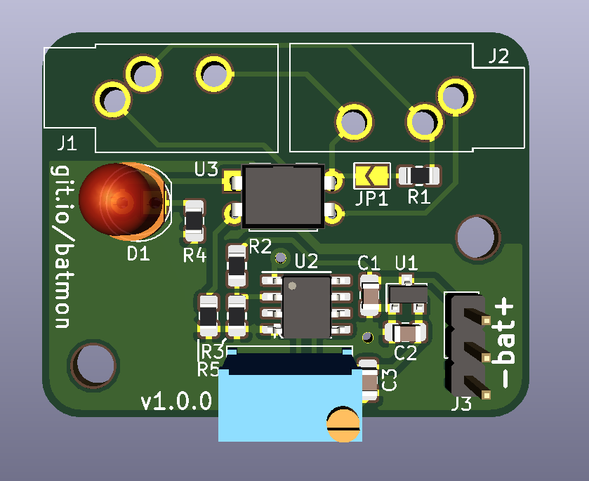
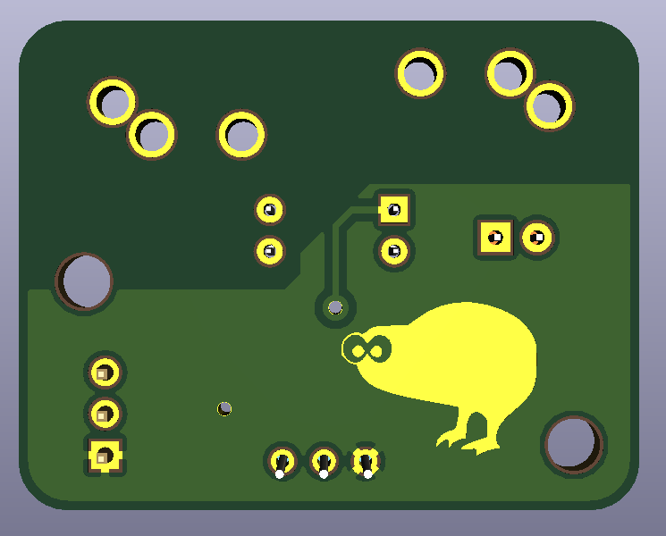

# chainable-bat-mon
A daisy chainable battery monitor

This is a battery monitor meant to monitor lead acid batteries. If the battery voltage goes below a configurable set point, 
set by the potentiometer, the LED will turn on, and the optocoupler will pull the output line on the TRS connectors low.

To use the signal, supply 5v and gnd on the tip and sleeve of a 3.5mm mini-jack cable, and solder the jumper on one of the PCBs. Then just chain them together.
If the battery voltage goes low on any of the batteries, the signal line will go low.

